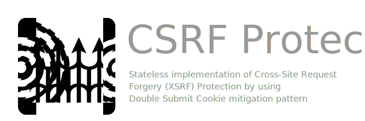

# FastAPI CSRF Protect

[](https://pypi.org/project/fastapi-csrf-protect)
[](https://pypi.org/project/fastapi-csrf-protect)
[](https://pypi.org/project/fastapi-csrf-protect)
[](https://pypi.org/project/fastapi-csrf-protect)
[](.)
[](.)
[](.)
[](.)
[](https://aekasitt.github.io/fastapi-csrf-protect)

[](https://github.com/aekasitt/fastapi-csrf-protect/blob/master/static/protect-banner.svg)

## Features

FastAPI extension that provides stateless Cross-Site Request Forgery (XSRF) Protection support.
Aimed to be easy to use and lightweight, we adopt [Double Submit Cookie](https://cheatsheetseries.owasp.org/cheatsheets/Cross-Site_Request_Forgery_Prevention_Cheat_Sheet.html#double-submit-cookie) mitigation pattern.
If you were familiar with `flask-wtf` library this extension suitable for you.
This extension inspired by `fastapi-jwt-auth` 😀

- Storing `fastapi-csrf-token` in cookies or serve it in template's context

## Installation

The easiest way to start working with this extension with pip

```bash
pip install fastapi-csrf-protect
# or
uv add fastapi-csrf-protect
```

## Getting Started

The following examples show you how to integrate this extension to a FastAPI App

### Example Login Form

```python
from fastapi import FastAPI, Request, Depends
from fastapi.responses import JSONResponse
from fastapi.templating import Jinja2Templates
from fastapi_csrf_protect import CsrfProtect
from fastapi_csrf_protect.exceptions import CsrfProtectError
from pydantic import BaseModel

app = FastAPI()
templates = Jinja2Templates(directory="templates")

class CsrfSettings(BaseModel):
  secret_key: str = "asecrettoeverybody"
  cookie_samesite: str = "none"

@CsrfProtect.load_config
def get_csrf_config():
  return CsrfSettings()

@app.get("/login")
def form(request: Request, csrf_protect: CsrfProtect = Depends()):
  """
  Returns form template.
  """
  csrf_token, signed_token = csrf_protect.generate_csrf_tokens()
  response = templates.TemplateResponse(
    "form.html", {"request": request, "csrf_token": csrf_token}
  )
  csrf_protect.set_csrf_cookie(signed_token, response)
  return response

@app.post("/login", response_class=JSONResponse)
async def create_post(request: Request, csrf_protect: CsrfProtect = Depends()):
  """
  Creates a new Post
  """
  await csrf_protect.validate_csrf(request)
  response: JSONResponse = JSONResponse(status_code=200, content={"detail": "OK"})
  csrf_protect.unset_csrf_cookie(response)  # prevent token reuse
  return response

@app.exception_handler(CsrfProtectError)
def csrf_protect_exception_handler(request: Request, exc: CsrfProtectError):
  return JSONResponse(status_code=exc.status_code, content={"detail": exc.message})

```

## Contributions

### Prerequisites


* [python](https://www.python.org) version 3.9 and above
* [uv](https://docs.astral.sh/uv)

### Setting up

The following guide walks through setting up your local working environment using `pyenv`
as Python version manager and `uv` as Python package manager. If you do not have `pyenv`
installed, run the following command.

<details>
  <summary> Install using Homebrew (Darwin) </summary>
  
  ```sh
  brew install pyenv --head
  ```
</details>

<details>
  <summary> Install using standalone installer (Darwin and Linux) </summary>
  
  ```sh
  curl https://pyenv.run | bash
  ```
</details>

If you do not have `uv` installed, run the following command.

<details>
  <summary> Install using Homebrew (Darwin) </summary>

  ```sh
  brew install uv
  ```
</details>

<details>
  <summary> Install using standalone installer (Darwin and Linux) </summary>

  ```sh
  curl -LsSf https://astral.sh/uv/install.sh | sh
  ```
</details>

Once you have `pyenv` Python version manager installed, you can
install any version of Python above version 3.9 for this project.
The following commands help you set up and activate a Python virtual
environment where `uv` can download project dependencies from the `PyPI`
open-sourced registry defined under `pyproject.toml` file.

<details>
  <summary> Set up environment and synchronize project dependencies </summary>

  ```sh
  pyenv shell 3.11.9
  uv venv  --python-preference system
  source .venv/bin/activate
  uv sync --dev
  ```
</details>

Now you have the entire project set-up and ready to be tinkered with. Try out the
standard `arise` command which brings up a help menu.

### Getting started
To contribute to the project, fork the repository and clone to your local device and install preferred testing dependency [pytest](https://github.com/pytest-dev/pytest)
Alternatively, run the following command on your terminal to do so:

```bash
uv sync --dev
```

Testing can be done by the following command post-installation:

```bash
uv sync --dev --extras test
pytest
```

## Changelog

### 🚧 Breaking Changes (0.3.0 -> 0.3.1) The double submit update

* The `generate_csrf` method has now been marked for deprecation
* The recommended method is now `generate_csrf_tokens` which returns a tuple of tokens, first unsigned
  and the latter signed
* Recommended pattern is for the first token is aimed for returning as part of context
* Recommended pattern is for the signed token to be set in client's cookie completing [Double Submit Cookie](https://cheatsheetseries.owasp.org/cheatsheets/Cross-Site_Request_Forgery_Prevention_Cheat_Sheet.html#double-submit-cookie)
* To prevent token reuse, protected endpoint can unset the signed CSRF Token in client's cookies as
  per example code and recommended pattern.

### 🚧 Breaking Changes (0.3.1 -> 0.3.2) The anti-JavaScript update

* New keys are added at setup `token_location` (either `body` or `header`) and `token_key` is key
  where form-encoded keeps the csrf token stored, cross-checked with csrf secret in cookies.
* Asynchronous `validate_csrf` method now needs to be awaited therefore protected endpoints need to
  be asynchronous as well.

### Error in version 0.3.5 after updating to Pydantic V2

* Made a blunder when updating from Pydantic V1 to Pydantic V2 and caused an error to occur when
  setting `cookie_samesite` in settings
* Fixed in version `0.3.6`

### Run Examples

To run the provided examples, first you must install extra dependencies [uvicorn](https://github.com/encode/uvicorn) and [jinja2](https://github.com/pallets/jinja/)
Alternatively, run the following command on your terminal to do so

```bash
uv sync --extras examples
```

Running the example utilizing form submission

```bash
uvicorn examples.body:app
```

Running the example utilizing headers via JavaScript

```bash
uvicorn examples.header:app
```

## License

This project is licensed under the terms of the MIT license.
